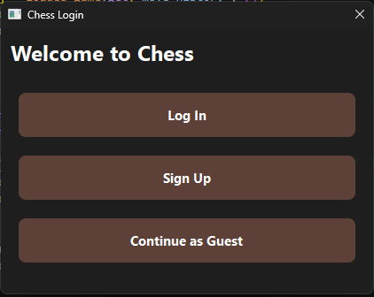
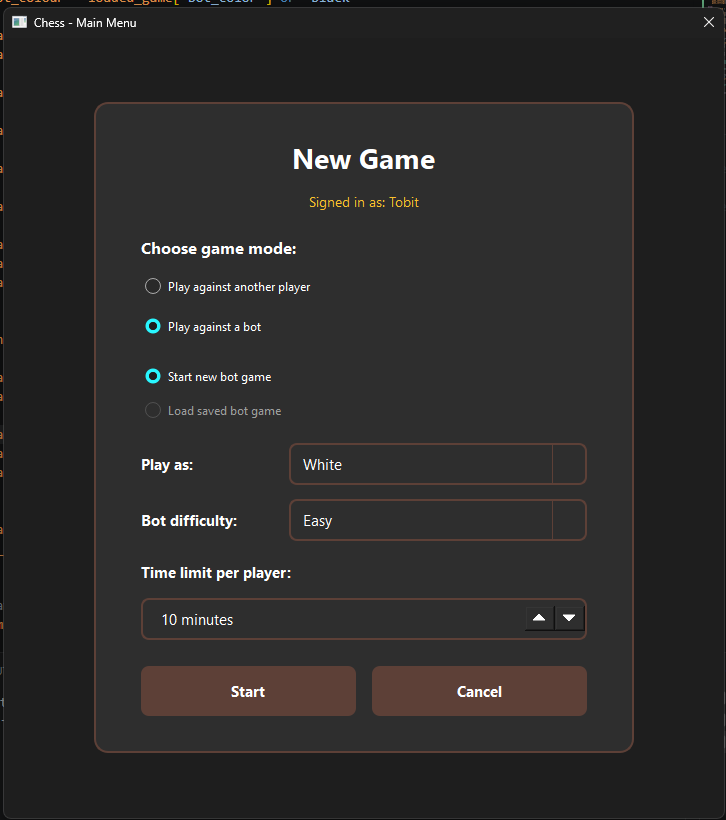
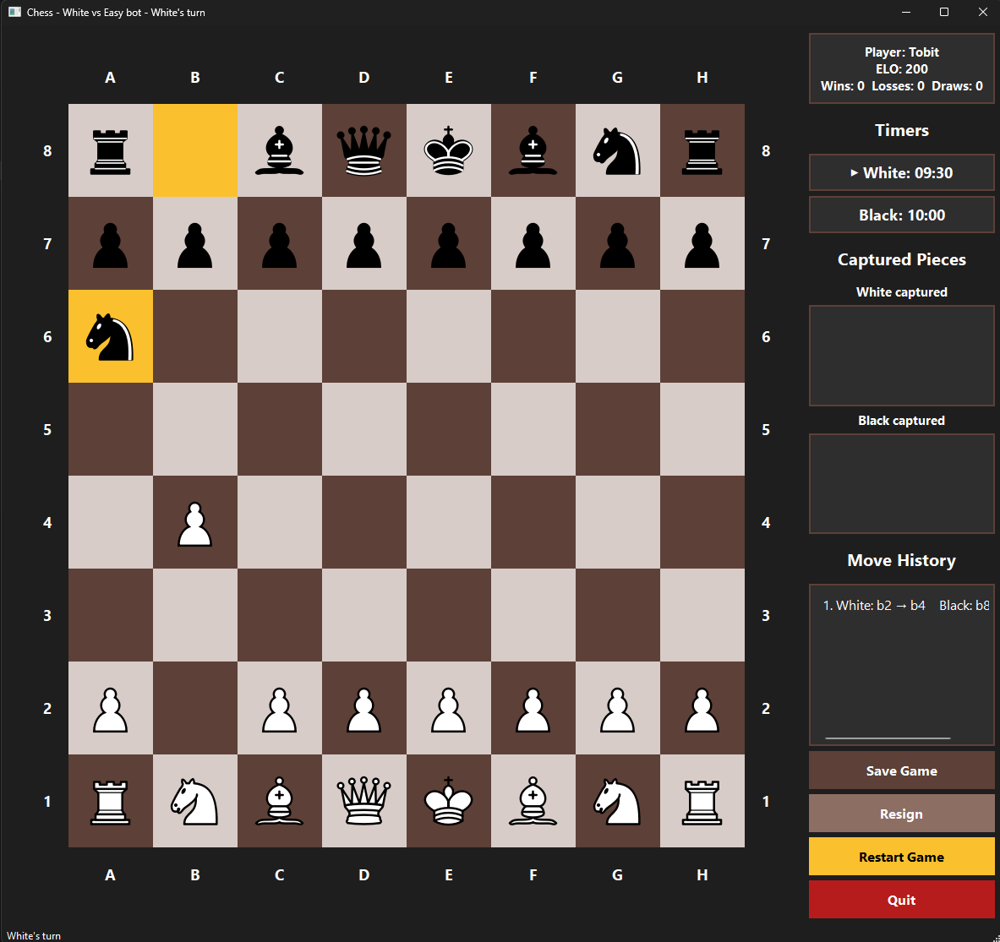
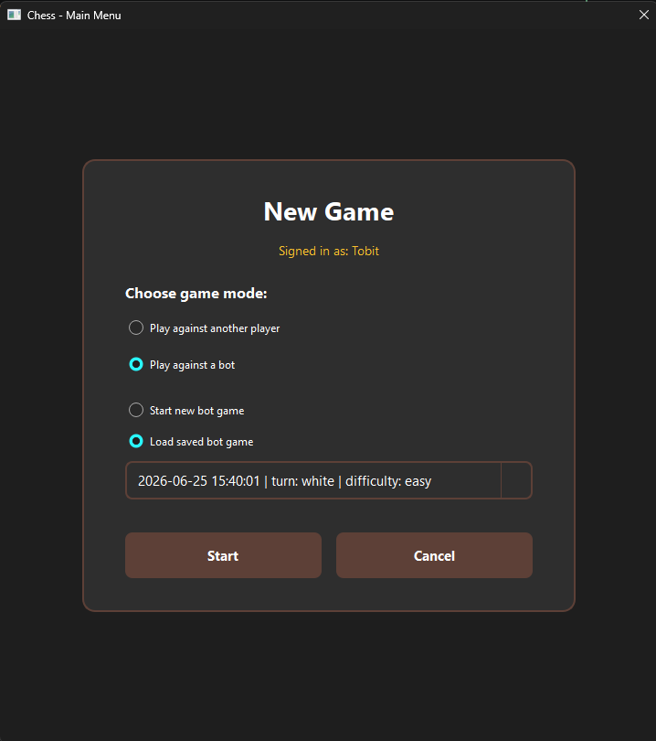
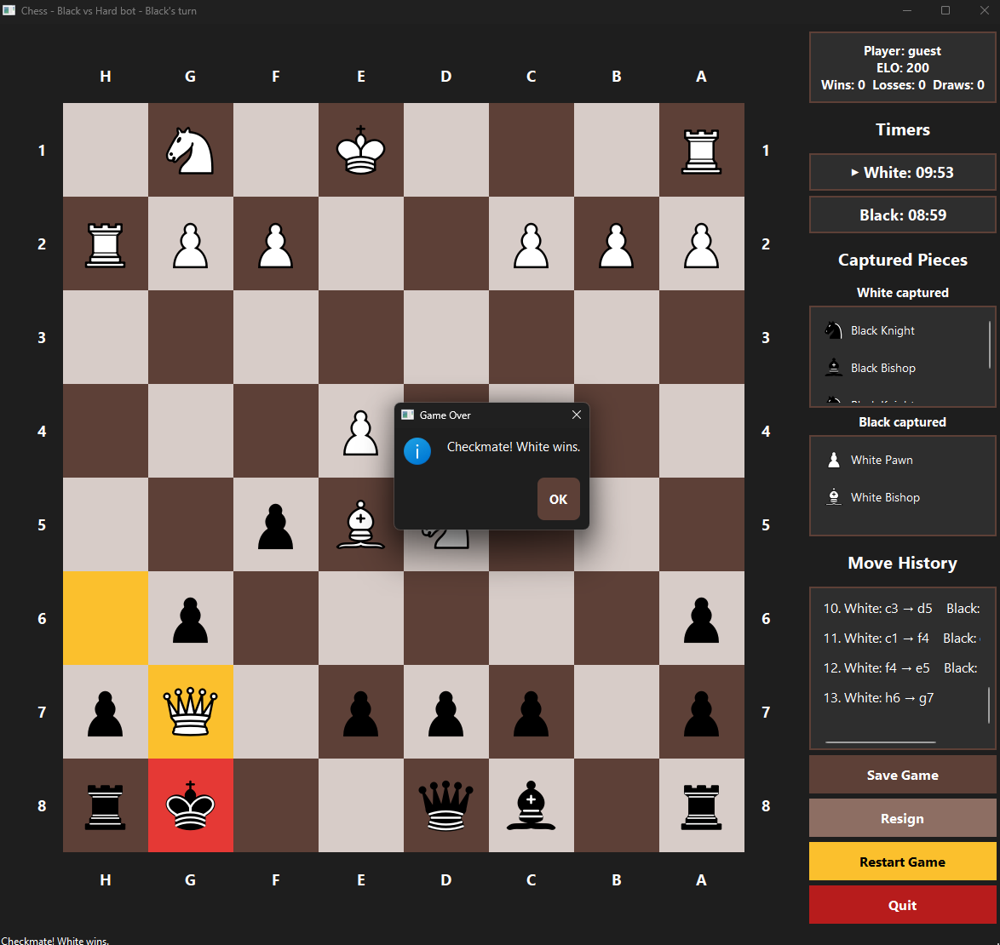

# Python Chess Game

A fully custom chess game built in Python with a PySide6 Qt graphical interface. The chess engine, move validation, special rules, bot logic, database system, and GUI were built manually without using external chess libraries.

This project is being developed as a learning and portfolio piece to demonstrate software engineering fundamentals, object-oriented programming, GUI development, database integration, algorithm design, and chess AI implementation.

---

# Project Structure

```text
PORTFOLIO PROJECT 1 - CHESS/
│
├── assets/
│   └── pieces/
│       Chess piece SVG files used by the GUI
│
├── chess/
│   ├── main.py
│   │   Starts the application and connects the main screens together
│   │
│   ├── chess_interface.py
│   │   Main PySide6 chess board interface
│   │
│   ├── game.py
│   │   Handles the game state, turns, legal moves, check, checkmate,
│   │   castling, en passant, promotion, and bot moves
│   │
│   ├── pieces.py
│   │   Piece classes and movement rules
│   │
│   ├── move_validator.py
│   │   Helper functions for checking valid player input and piece ownership
│   │
│   ├── utils.py
│   │   Coordinate conversion and small helper functions
│   │
│   ├── board.py
│   │   Creates the starting board and stores board-related helpers
│   │
│   ├── player.py
│   │   Basic player class
│   │
│   ├── database.py
│   │   SQLite database functions for accounts, saved games, and player stats
│   │
│   ├── login.py
│   │   Login, sign-up, and guest access dialog
│   │
│   ├── main_menu.py
│   │   Main menu for choosing game mode, bot settings, time limit,
│   │   and saved games
│   │
│   ├── elo.py
│   │   ELO calculation and rating update functions
│   │
│   ├── theme.py
│   │   Shared GUI styling
│   │
│   └── screenshots/
│       Screenshots used in the README
│
├── practice/
│   Early test files and prototypes from before the GUI version
│
├── chess_game.db
│   Local SQLite database file
│
├── .gitignore
│
└── README.md
```

---

## Screenshots

### Login / Guest Access



The game starts with a login screen. Users can sign in, create an account, or continue as a guest. Logged-in users can save games, load saved bot games, and track their ELO score.

### Main Menu



The main menu groups all game setup options into one screen. Players can choose between player-vs-player mode or playing against a bot. Bot games allow the player to choose their colour, bot difficulty, and time limit.

### Gameplay



The main game screen includes the chess board, legal move highlighting, last-move highlighting, check detection, timers, captured pieces, and move history.

### Loading Saved Games



Logged-in users can load saved bot games. Saved games restore the board position, current turn, bot difficulty, timers, move history, and captured pieces.

### Game Over / ELO Update



When a game ends by checkmate, stalemate, timeout, or resignation, the result is shown in a popup. Logged-in users have their ELO score and win/loss/draw record updated automatically.


---

# Current Features

## Graphical User Interface

* PySide6 Qt-based desktop GUI
* Click-to-select piece movement
* Legal move highlighting
* Last-move highlighting
* Check highlighting on the king square
* Chess coordinate labels around the board
* Optional board rotation when playing as black
* Move history side panel
* Captured pieces panel with icons
* Restart and quit controls
* Styled dialogs and popups using a shared application theme
* Game-over popup messages for checkmate, stalemate, and timeout

---

## Chess Engine Core

* 8x8 board representation using a 2D list
* Turn-based system for White and Black
* Piece ownership validation
* Legal move generation
* Move simulation and undo logic for legality checking
* Capture detection
* Check detection
* Checkmate detection
* Stalemate detection

Fully implemented movement rules for:

* Pawn
* Rook
* Knight
* Bishop
* Queen
* King

Special chess rules implemented:

* Castling
* En passant
* Pawn promotion
* Prevention of illegal king exposure
* Prevention of king capture

---

## Bot / AI System

The project includes three bot difficulty levels:

### Easy Bot

* Basic move selection
* Prioritises simple captures
* Uses lightweight greedy logic

### Medium Bot

* Material-based move evaluation
* Rewards captures, development, centre control, promotion, castling, and checks
* Penalises unsafe moves

### Hard Bot

* Minimax search algorithm
* Alpha-beta pruning
* Board evaluation function
* Move ordering
* Search depth adjusted based on remaining pieces

---

## Database and Account System

* SQLite database integration
* Player account table
* Saved games table
* Login screen
* Sign-up screen
* Guest mode
* Password hashing
* Stored player statistics:

  * ELO
  * Wins
  * Losses
  * Draws

The database layer supports saving and loading game state, including:

* Board state
* Current turn
* Bot difficulty
* Bot colour
* Time settings
* Remaining player time

---

## Chess Clock

* User chooses time limit before the game starts
* Separate countdown timer for each player
* Active player's timer decreases during their turn
* Timeout ends the game
* Timeout result is shown in the status bar and popup dialog

---

# Technologies Used

* Python
* PySide6
* SQLite3
* Object-Oriented Programming
* 2D array-based board state
* Custom chess rules engine
* Minimax algorithm
* Alpha-beta pruning
* Git version control
* GitHub
* Visual Studio Code

---

# How to Run

Clone the repository:

```bash
git clone https://github.com/YOUR_USERNAME/YOUR_REPO.git
```

Navigate into the project:

```bash
cd YOUR_REPO
```

Install dependencies:

```bash
pip install PySide6
```

Run the application:

```bash
python chess/main.py
```

---

# Development Philosophy

This project is being built incrementally with a focus on:

* Building the chess engine manually instead of relying on chess libraries
* Keeping game rules separate from the GUI
* Maintaining clear separation between board logic, piece logic, game control, database logic, and interface code
* Developing features first in small testable steps
* Gradually improving the user experience through GUI polish
* Using the project as a portfolio demonstration of practical Python software development

---

# Current Status

The core chess game is playable through the PySide6 GUI.

Implemented systems include:

* Full legal piece movement
* Special chess rules
* Check, checkmate, and stalemate detection
* Bot play with multiple difficulty levels
* Login/sign-up/guest flow
* SQLite database layer
* Chess clock
* Move history
* Captured pieces display
* Styled interface elements
* ELO updates after completed games
* Full GUI save/load game system

---

# Known Limitations / Future Improvements

Planned or future improvements include:

* Threefold repetition detection
* Fifty-move rule
* Insufficient material detection
* Packaged executable release
* Unit tests for the chess engine

---

# Author

Created by Tobit Vervat
